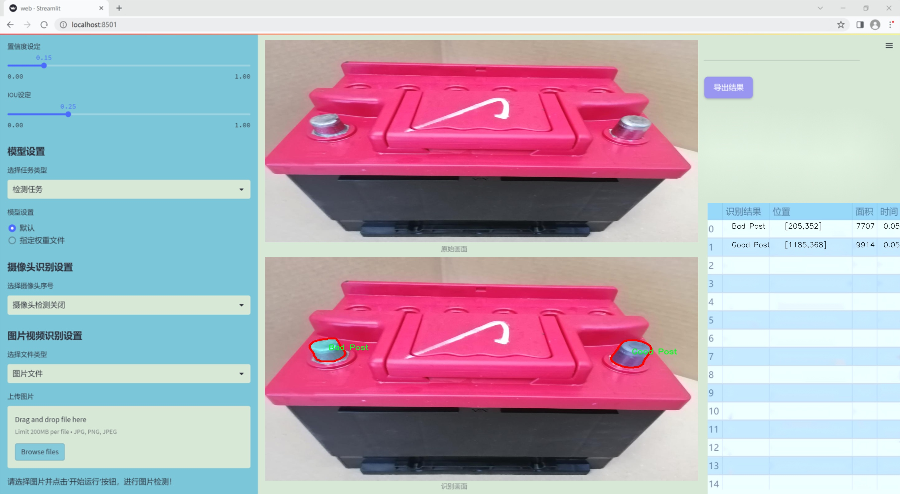

### 1.背景意义

研究背景与意义

随着可再生能源的快速发展，电池储能系统在现代电力系统中扮演着越来越重要的角色。电池柱作为电池储能系统的核心组件，其状态的实时监测与评估对于保障系统的安全性和可靠性至关重要。然而，传统的电池柱状态检测方法往往依赖人工检查，效率低下且容易受到人为因素的影响，难以满足现代工业对高效、准确监测的需求。因此，开发一种基于计算机视觉的自动化检测系统显得尤为重要。

在这一背景下，基于改进YOLOv11的电池柱状态检测系统应运而生。YOLO（You Only Look Once）系列模型以其快速的检测速度和高精度的特点，成为目标检测领域的热门选择。通过对YOLOv11进行改进，结合电池柱的特定特征，可以有效提升检测的准确性和实时性。我们将利用包含3122张图像的In-Line Post Training Data v1数据集，该数据集经过精心标注，涵盖了“Bad Post”和“Good Post”两类状态，为模型的训练提供了丰富的样本。

本研究的意义在于，通过引入先进的深度学习技术，构建一个高效的电池柱状态检测系统，不仅可以提高检测的自动化水平，还能大幅降低人工成本和潜在的安全隐患。此外，系统的成功实施将为电池储能行业的智能化发展提供有力支持，推动相关技术的应用与普及。通过不断优化和迭代模型，我们期望能够在未来实现更高的检测精度和更广泛的应用场景，为电池管理系统的智能化升级贡献力量。

### 2.视频效果

[2.1 视频效果](https://www.bilibili.com/video/BV1kTkjYhERF/)

### 3.图片效果




##### [项目涉及的源码数据来源链接](https://kdocs.cn/l/cszuIiCKVNis)**

注意：本项目提供训练的数据集和训练教程,由于版本持续更新,暂不提供权重文件（best.pt）,请按照6.训练教程进行训练后实现上图演示的效果。

### 4.数据集信息

##### 4.1 本项目数据集类别数＆类别名

nc: 2
names: ['Bad Post', 'Good Post']


该项目为【图像分割】数据集，请在【训练教程和Web端加载模型教程（第三步）】这一步的时候按照【图像分割】部分的教程来训练

##### 4.2 本项目数据集信息介绍

本项目数据集信息介绍

本项目所使用的数据集名为“In-Line Post Training Data v1”，旨在为改进YOLOv11的电池柱状态检测系统提供高质量的训练数据。该数据集专注于电池柱的状态识别，涵盖了两种主要类别：'Bad Post'和'Good Post'。通过对这两类数据的深入分析和学习，模型能够有效地识别电池柱的良好状态与不良状态，从而提升电池管理系统的智能化水平。

数据集的构建过程中，采集了大量的电池柱图像，确保了样本的多样性和代表性。每个类别的图像均经过精心标注，确保模型在训练过程中能够准确学习到每种状态的特征。'Bad Post'类别包含了各种可能导致电池柱失效的情况，例如腐蚀、物理损伤或连接不良等；而'Good Post'类别则展示了电池柱在最佳工作状态下的外观特征。这种明确的分类使得模型在面对实际应用时，能够迅速而准确地做出判断。

此外，为了增强模型的泛化能力，数据集中还包含了不同环境条件下拍摄的图像，如不同的光照、角度和背景。这种多样化的训练数据不仅提高了模型的鲁棒性，也为其在实际应用中的适应性打下了坚实的基础。通过对“In-Line Post Training Data v1”数据集的充分利用，本项目期望能够显著提升YOLOv11在电池柱状态检测中的准确性和效率，为电池管理系统的智能化发展贡献力量。


### 5.全套项目环境部署视频教程（零基础手把手教学）

[5.1 所需软件PyCharm和Anaconda安装教程（第一步）](https://www.bilibili.com/video/BV1BoC1YCEKi/?spm_id_from=333.999.0.0&vd_source=bc9aec86d164b67a7004b996143742dc)


[5.2 安装Python虚拟环境创建和依赖库安装视频教程（第二步）](https://www.bilibili.com/video/BV1ZoC1YCEBw?spm_id_from=333.788.videopod.sections&vd_source=bc9aec86d164b67a7004b996143742dc)

### 6.改进YOLOv11训练教程和Web_UI前端加载模型教程（零基础手把手教学）

[6.1 改进YOLOv11训练教程和Web_UI前端加载模型教程（第三步）](https://www.bilibili.com/video/BV1BoC1YCEhR?spm_id_from=333.788.videopod.sections&vd_source=bc9aec86d164b67a7004b996143742dc)


按照上面的训练视频教程链接加载项目提供的数据集，运行train.py即可开始训练



     Epoch   gpu_mem       box       obj       cls    labels  img_size
     1/200     20.8G   0.01576   0.01955  0.007536        22      1280: 100%|██████████| 849/849 [14:42<00:00,  1.04s/it]
               Class     Images     Labels          P          R     mAP@.5 mAP@.5:.95: 100%|██████████| 213/213 [01:14<00:00,  2.87it/s]
                 all       3395      17314      0.994      0.957      0.0957      0.0843

     Epoch   gpu_mem       box       obj       cls    labels  img_size
     2/200     20.8G   0.01578   0.01923  0.007006        22      1280: 100%|██████████| 849/849 [14:44<00:00,  1.04s/it]
               Class     Images     Labels          P          R     mAP@.5 mAP@.5:.95: 100%|██████████| 213/213 [01:12<00:00,  2.95it/s]
                 all       3395      17314      0.996      0.956      0.0957      0.0845

     Epoch   gpu_mem       box       obj       cls    labels  img_size
     3/200     20.8G   0.01561    0.0191  0.006895        27      1280: 100%|██████████| 849/849 [10:56<00:00,  1.29it/s]
               Class     Images     Labels          P          R     mAP@.5 mAP@.5:.95: 100%|███████   | 187/213 [00:52<00:00,  4.04it/s]
                 all       3395      17314      0.996      0.957      0.0957      0.0845


###### [项目数据集下载链接](https://kdocs.cn/l/cszuIiCKVNis)

### 7.原始YOLOv11算法讲解


ultralytics发布了最新的作品YOLOv11，这一次YOLOv11的变化相对于ultralytics公司的上一代作品YOLOv8变化不是很大的（YOLOv9、YOLOv10均不是ultralytics公司作品），其中改变的位置涉及到C2f变为C3K2，在SPPF后面加了一层类似于注意力机制的C2PSA，还有一个变化大家从yaml文件是看不出来的就是它的检测头内部替换了两个DWConv，以及模型的深度和宽度参数进行了大幅度调整，但是在损失函数方面就没有变化还是采用的CIoU作为边界框回归损失，下面带大家深入理解一下ultralytics最新作品YOLOv11的创新点。

**下图为最近的YOLO系列发布时间线！**


* * *

###### YOLOv11和YOLOv8对比

在YOLOYOLOv5，YOLOv8，和YOLOv11是ultralytics公司作品（ultralytics出品必属精品），下面用一张图片从yaml文件来带大家对比一下YOLOv8和YOLOv11的区别，配置文件变得内容比较少大家可以看一卡，左侧为YOLOv8右侧为YOLOv11，不同的点我用黑线标注了出来。


* * *

###### YOLOv11的网络结构解析

下面的图片为YOLOv11的网络结构图。


**其中主要创新点可以总结如下- > **

* * *

1\.
提出C3k2机制，其中C3k2有参数为c3k，其中在网络的浅层c3k设置为False（下图中可以看到c3k2第二个参数被设置为False，就是对应的c3k参数）。


此时所谓的C3k2就相当于YOLOv8中的C2f，其网络结构为一致的，其中的C3k机制的网络结构图如下图所示
**（为什么叫C3k2，我个人理解是因为C3k的调用时C3k其中的参数N固定设置为2的原因，个人理解不一定对** ）。


* * *

2\.
第二个创新点是提出C2PSA机制，这是一个C2（C2f的前身）机制内部嵌入了一个多头注意力机制，在这个过程中我还发现作者尝试了C2fPSA机制但是估计效果不如C2PSA，有的时候机制有没有效果理论上真的很难解释通，下图为C2PSA机制的原理图，仔细观察把Attention哪里去掉则C2PSA机制就变为了C2所以我上面说C2PSA就是C2里面嵌入了一个PSA机制。


* * *

3\.
第三个创新点可以说是原先的解耦头中的分类检测头增加了两个DWConv，具体的对比大家可以看下面两个图下面的是YOLOv11的解耦头，上面的是YOLOv8的解耦头.


我们上面看到了在分类检测头中YOLOv11插入了两个DWConv这样的做法可以大幅度减少参数量和计算量（原先两个普通的Conv大家要注意到卷积和是由3变为了1的，这是形成了两个深度可分离Conv），大家可能不太理解为什么加入了两个DWConv还能够减少计算量，以及什么是深度可分离Conv，下面我来解释一下。

> **`DWConv` 代表 Depthwise
> Convolution（深度卷积）**，是一种在卷积神经网络中常用的高效卷积操作。它主要用于减少计算复杂度和参数量，尤其在移动端或轻量化网络（如
> MobileNet）中十分常见。
>
> **1\. 标准卷积的计算过程**
>
> 在标准卷积操作中，对于一个输入张量（通常是一个多通道的特征图），卷积核的尺寸是 `(h, w, C_in)`，其中 `h` 和 `w`
> 是卷积核的空间尺寸，`C_in`
> 是输入通道的数量。而卷积核与输入张量做的是完整的卷积运算，每个输出通道都与所有输入通道相连并参与卷积操作，导致计算量比较大。
>
> 标准卷积的计算过程是这样的：
>
>   * 每个输出通道是所有输入通道的组合（加权求和），卷积核在每个位置都会计算与所有输入通道的点积。
>   * 假设有 `C_in` 个输入通道和 `C_out` 个输出通道，那么卷积核的总参数量是 `C_in * C_out * h * w`。
>

>
> 2\. **Depthwise Convolution（DWConv）**
>
> 与标准卷积不同， **深度卷积** 将输入的每个通道单独处理，即 **每个通道都有自己的卷积核进行卷积**
> ，不与其他通道进行交互。它可以被看作是标准卷积的一部分，专注于空间维度上的卷积运算。
>
> **深度卷积的计算过程：**
>
>   * 假设输入张量有 `C_in` 个通道，每个通道会使用一个 `h × w`
> 的卷积核进行卷积操作。这个过程称为“深度卷积”，因为每个通道独立进行卷积运算。
>   * 输出的通道数与输入通道数一致，每个输出通道只和对应的输入通道进行卷积，没有跨通道的组合。
>   * 参数量和计算量相比标准卷积大大减少，卷积核的参数量是 `C_in * h * w`。
>

>
> **深度卷积的优点：**
>
>   1. **计算效率高** ：相对于标准卷积，深度卷积显著减少了计算量。它只处理空间维度上的卷积，不再处理通道间的卷积。
>   2.  **参数量减少** ：由于每个卷积核只对单个通道进行卷积，参数量大幅减少。例如，标准卷积的参数量为 `C_in * C_out * h *
> w`，而深度卷积的参数量为 `C_in * h * w`。
>   3.  **结合点卷积可提升效果** ：为了弥补深度卷积缺乏跨通道信息整合的问题，通常深度卷积后会配合 `1x1` 的点卷积（Pointwise
> Convolution）使用，通过 `1x1` 的卷积核整合跨通道的信息。这种组合被称为 **深度可分离卷积** （Depthwise
> Separable Convolution） | **这也是我们本文YOLOv11中的做法** 。
>

>
> 3\. **深度卷积与标准卷积的区别**
>
> 操作类型| 卷积核大小| 输入通道数| 输出通道数| 参数量  
> ---|---|---|---|---  
> 标准卷积| `h × w`| `C_in`| `C_out`| `C_in * C_out * h * w`  
> 深度卷积（DWConv）| `h × w`| `C_in`| `C_in`| `C_in * h * w`  
>  
> 可以看出，深度卷积在相同的卷积核大小下，参数量减少了约 `C_out` 倍
> （细心的人可以发现用最新版本的ultralytics仓库运行YOLOv8参数量相比于之前的YOLOv8以及大幅度减少了这就是因为检测头改了的原因但是名字还是Detect，所以如果你想继续用YOLOv8发表论文做实验那么不要更新最近的ultralytics仓库）。
>
> **4\. 深度可分离卷积 (Depthwise Separable Convolution)**
>
> 深度卷积常与 `1x1` 的点卷积配合使用，这称为深度可分离卷积。其过程如下：
>
>   1. 先对输入张量进行深度卷积，对每个通道独立进行空间卷积。
>   2. 然后通过 `1x1` 点卷积，对通道维度进行混合，整合不同通道的信息。
>

>
> 这样既可以保证计算量的减少，又可以保持跨通道的信息流动。
>
> 5\. **总结**
>
> `DWConv` 是一种高效的卷积方式，通过单独处理每个通道来减少计算量，结合 `1x1`
> 的点卷积，形成深度可分离卷积，可以在保持网络性能的同时极大地减少模型的计算复杂度和参数量。

**看到这里大家应该明白了为什么加入了两个DWConv还能减少参数量以及YOLOv11的检测头创新点在哪里。**

* * *

##### YOLOv11和YOLOv8还有一个不同的点就是其各个版本的模型（N - S - M- L - X）网络深度和宽度变了


可以看到在深度（depth）和宽度
（width）两个地方YOLOv8和YOLOv11是基本上完全不同了，这里我理解这么做的含义就是模型网络变小了，所以需要加深一些模型的放缩倍数来弥补模型之前丧失的能力从而来达到一个平衡。

> **本章总结：**
> YOLOv11的改进点其实并不多更多的都是一些小的结构上的创新，相对于之前的YOLOv5到YOLOv8的创新，其实YOLOv11的创新点不算多，但是其是ultralytics公司的出品，同时ultralytics仓库的使用量是非常多的（不像YOLOv9和YOLOv10）所以在未来的很长一段时间内其实YOLO系列估计不会再更新了，YOLOv11作为最新的SOTA肯定是十分适合大家来发表论文和创新的。
>

### 8.200+种全套改进YOLOV11创新点原理讲解

#### 8.1 200+种全套改进YOLOV11创新点原理讲解大全

由于篇幅限制，每个创新点的具体原理讲解就不全部展开，具体见下列网址中的改进模块对应项目的技术原理博客网址【Blog】（创新点均为模块化搭建，原理适配YOLOv5~YOLOv11等各种版本）

[改进模块技术原理博客【Blog】网址链接](https://gitee.com/qunmasj/good)


#### 8.2 精选部分改进YOLOV11创新点原理讲解

###### 这里节选部分改进创新点展开原理讲解(完整的改进原理见上图和[改进模块技术原理博客链接](https://gitee.com/qunmasj/good)【如果此小节的图加载失败可以通过CSDN或者Github搜索该博客的标题访问原始博客，原始博客图片显示正常】


借鉴了其他算法的这些设计思想

借鉴了VGG的思想，使用了较多的3×3卷积，在每一次池化操作后，将通道数翻倍；

借鉴了network in network的思想，使用全局平均池化（global average pooling）做预测，并把1×1的卷积核置于3×3的卷积核之间，用来压缩特征；（我没找到这一步体现在哪里）

使用了批归一化层稳定模型训练，加速收敛，并且起到正则化作用。

    以上三点为Darknet19借鉴其他模型的点。Darknet53当然是在继承了Darknet19的这些优点的基础上再新增了下面这些优点的。因此列在了这里

借鉴了ResNet的思想，在网络中大量使用了残差连接，因此网络结构可以设计的很深，并且缓解了训练中梯度消失的问题，使得模型更容易收敛。

使用步长为2的卷积层代替池化层实现降采样。（这一点在经典的Darknet-53上是很明显的，output的长和宽从256降到128，再降低到64，一路降低到8，应该是通过步长为2的卷积层实现的；在YOLOv11的卷积层中也有体现，比如图中我标出的这些位置）

#### 特征融合

模型架构图如下

  Darknet-53的特点可以这样概括：（Conv卷积模块+Residual Block残差块）串行叠加4次

  Conv卷积层+Residual Block残差网络就被称为一个stage


上面红色指出的那个，原始的Darknet-53里面有一层 卷积，在YOLOv11里面，把一层卷积移除了

为什么移除呢？

        原始Darknet-53模型中间加的这个卷积层做了什么？滤波器（卷积核）的个数从 上一个卷积层的512个，先增加到1024个卷积核，然后下一层卷积的卷积核的个数又降低到512个

        移除掉这一层以后，少了1024个卷积核，就可以少做1024次卷积运算，同时也少了1024个3×3的卷积核的参数，也就是少了9×1024个参数需要拟合。这样可以大大减少了模型的参数，（相当于做了轻量化吧）

        移除掉这个卷积层，可能是因为作者发现移除掉这个卷积层以后，模型的score有所提升，所以才移除掉的。为什么移除掉以后，分数有所提高呢？可能是因为多了这些参数就容易，参数过多导致模型在训练集删过拟合，但是在测试集上表现很差，最终模型的分数比较低。你移除掉这个卷积层以后，参数减少了，过拟合现象不那么严重了，泛化能力增强了。当然这个是，拿着你做实验的结论，反过来再找补，再去强行解释这种现象的合理性。

过拟合


通过MMdetection官方绘制册这个图我们可以看到，进来的这张图片经过一个“Feature Pyramid Network(简称FPN)”，然后最后的P3、P4、P5传递给下一层的Neck和Head去做识别任务。 PAN（Path Aggregation Network）


“FPN是自顶向下，将高层的强语义特征传递下来。PAN就是在FPN的后面添加一个自底向上的金字塔，对FPN补充，将低层的强定位特征传递上去，

FPN是自顶（小尺寸，卷积次数多得到的结果，语义信息丰富）向下（大尺寸，卷积次数少得到的结果），将高层的强语义特征传递下来，对整个金字塔进行增强，不过只增强了语义信息，对定位信息没有传递。PAN就是针对这一点，在FPN的后面添加一个自底（卷积次数少，大尺寸）向上（卷积次数多，小尺寸，语义信息丰富）的金字塔，对FPN补充，将低层的强定位特征传递上去，又被称之为“双塔战术”。

FPN层自顶向下传达强语义特征，而特征金字塔则自底向上传达强定位特征，两两联手，从不同的主干层对不同的检测层进行参数聚合,这样的操作确实很皮。
#### 自底向上增强

而 PAN（Path Aggregation Network）是对 FPN 的一种改进，它的设计理念是在 FPN 后面添加一个自底向上的金字塔。PAN 引入了路径聚合的方式，通过将浅层特征图（低分辨率但语义信息较弱）和深层特征图（高分辨率但语义信息丰富）进行聚合，并沿着特定的路径传递特征信息，将低层的强定位特征传递上去。这样的操作能够进一步增强多尺度特征的表达能力，使得 PAN 在目标检测任务中表现更加优秀。


### 可重参化EfficientRepBiPAN优化Neck
#### Repvgg-style
Repvgg-style的卷积层包含
卷积+ReLU结构，该结构能够有效地利用硬件资源。

在训练时，Repvgg-style的卷积层包含
卷积、
卷积、identity。（下图左图）


在推理时，通过重参数化（re-parameterization），上述的多分支结构可以转换为单分支的
卷积。（下图右图）


基于上述思想，作者设计了对GPU硬件友好的EfficientRep Backbone和Rep-PAN Neck，将它们用于YOLOv6中。

EfficientRep Backbone的结构图：


Rep-PAN Neck结构图：


#### Multi-path
只使用repvgg-style不能达到很好的精度-速度平衡，对于大模型，作者探索了多路径的网络结构。

参考该博客提出了Bep unit，其结构如下图所示：


CSP（Cross Stage Partial）-style计算量小，且有丰富的梯度融合信息，广泛应用于YOLO系列中，比如YOLOv11、PPYOLOE。

作者将Bep unit与CSP-style结合，设计了一种新的网络结构BepC3，如下图所示：


基于BepC3模块，作者设计了新的CSPBep Backbone和CSPRepPAN Neck，以达到很好的精度-速度平衡。

其他YOLO系列在使用CSP-stype结构时，partial ratio设置为1/2。为了达到更好的性能，在YOLOv6m中partial ratio的值为2/3，在YOLOv6l中partial ratio的值为1/2。

对于YOLOv6m，单纯使用Rep-style结构和使用BepC3结构的对比如下图所示：

#### BIFPN
BiFPN 全称 Bidirectional Feature Pyramid Network 加权双向（自顶向下 + 自低向上）特征金字塔网络。

相比较于PANet，BiFPN在设计上的改变：

总结下图：
图d 蓝色部分为自顶向下的通路，传递的是高层特征的语义信息；红色部分是自底向上的通路，传递的是低层特征的位置信息；紫色部分是上述第二点提到的同一层在输入节点和输入节点间新加的一条边。


我们删除那些只有一条输入边的节点。这么做的思路很简单：如果一个节点只有一条输入边而没有特征融合，那么它对旨在融合不同特征的特征网络的贡献就会很小。删除它对我们的网络影响不大，同时简化了双向网络；如上图d 的 P7右边第一个节点

如果原始输入节点和输出节点处于同一层，我们会在原始输入节点和输出节点之间添加一条额外的边。思路：以在不增加太多成本的情况下融合更多的特性；

与只有一个自顶向下和一个自底向上路径的PANet不同，我们处理每个双向路径(自顶向下和自底而上)路径作为一个特征网络层，并重复同一层多次，以实现更高层次的特征融合。如下图EfficientNet 的网络结构所示，我们对BiFPN是重复使用多次的。而这个使用次数也不是我们认为设定的，而是作为参数一起加入网络的设计当中，使用NAS技术算出来的。


Weighted Feature Fusion 带权特征融合：学习不同输入特征的重要性，对不同输入特征有区分的融合。
设计思路：传统的特征融合往往只是简单的 feature map 叠加/相加 (sum them up)，比如使用concat或者shortcut连接，而不对同时加进来的 feature map 进行区分。然而，不同的输入 feature map 具有不同的分辨率，它们对融合输入 feature map 的贡献也是不同的，因此简单的对他们进行相加或叠加处理并不是最佳的操作。所以这里我们提出了一种简单而高效的加权特融合的机制。
常见的带权特征融合有三种方法，分别是：


​
  这种方法比较简单，直接加一个可学习的权重。但是由于这个权重不受限制，所有可能引起训练的不稳定，所有并不推荐。
Softmax-based fusion: O = ∑ i e w i ∗ I i ϵ + ∑ j e w j O = \sum_{i} \frac{e^{w_i} * I_i}{ \epsilon+\sum_{j}e^{w_j}}O=∑ 

 

​
  使用这种方法可以将范围放缩到 [ 0 , 1 ] [0, 1][0,1] 之间，训练稳定，但是训练很慢，所有也不推荐。
Fast normalized fusion: O = ∑ i w i ∗ I i ϵ + ∑ j w j O = \sum_{i} \frac{w_i * I_i}{ \epsilon+\sum_{j}w_j}O=∑ 


### 9.系统功能展示

图9.1.系统支持检测结果表格显示

  图9.2.系统支持置信度和IOU阈值手动调节

  图9.3.系统支持自定义加载权重文件best.pt(需要你通过步骤5中训练获得)

  图9.4.系统支持摄像头实时识别

  图9.5.系统支持图片识别

  图9.6.系统支持视频识别

  图9.7.系统支持识别结果文件自动保存

  图9.8.系统支持Excel导出检测结果数据


### 10. YOLOv11核心改进源码讲解

#### 10.1 rep_block.py

以下是对给定代码的核心部分进行分析和详细注释的结果。代码主要实现了多分支卷积块（Diverse Branch Block），用于深度学习中的卷积神经网络（CNN）架构。我们将保留核心功能并添加注释。

```python
import torch
import torch.nn as nn
import torch.nn.functional as F

# 定义一个用于卷积和批归一化融合的函数
def transI_fusebn(kernel, bn):
    # 从批归一化层中提取参数
    gamma = bn.weight  # 缩放因子
    std = (bn.running_var + bn.eps).sqrt()  # 标准差
    # 返回融合后的卷积核和偏置
    return kernel * ((gamma / std).reshape(-1, 1, 1, 1)), bn.bias - bn.running_mean * gamma / std

# 定义一个卷积和批归一化的组合层
def conv_bn(in_channels, out_channels, kernel_size, stride=1, padding=0, dilation=1, groups=1):
    # 创建卷积层
    conv_layer = nn.Conv2d(in_channels=in_channels, out_channels=out_channels, kernel_size=kernel_size,
                           stride=stride, padding=padding, dilation=dilation, groups=groups,
                           bias=False)
    # 创建批归一化层
    bn_layer = nn.BatchNorm2d(num_features=out_channels, affine=True)
    # 将卷积层和批归一化层组合在一起
    return nn.Sequential(conv_layer, bn_layer)

# 定义多分支卷积块
class DiverseBranchBlock(nn.Module):
    def __init__(self, in_channels, out_channels, kernel_size, stride=1, padding=None, dilation=1, groups=1):
        super(DiverseBranchBlock, self).__init__()
        
        # 初始化参数
        self.kernel_size = kernel_size
        self.in_channels = in_channels
        self.out_channels = out_channels
        self.groups = groups
        
        # 计算填充
        if padding is None:
            padding = kernel_size // 2  # 默认填充为卷积核大小的一半
        assert padding == kernel_size // 2

        # 定义主卷积分支
        self.dbb_origin = conv_bn(in_channels=in_channels, out_channels=out_channels, kernel_size=kernel_size,
                                  stride=stride, padding=padding, dilation=dilation, groups=groups)

        # 定义平均池化分支
        self.dbb_avg = nn.Sequential(
            nn.Conv2d(in_channels=in_channels, out_channels=out_channels, kernel_size=1, stride=1, padding=0, groups=groups, bias=False),
            nn.BatchNorm2d(out_channels),
            nn.AvgPool2d(kernel_size=kernel_size, stride=stride, padding=0)
        )

        # 定义1x1卷积分支
        self.dbb_1x1_kxk = nn.Sequential(
            nn.Conv2d(in_channels=in_channels, out_channels=out_channels, kernel_size=1, stride=stride, padding=0, groups=groups, bias=False),
            nn.BatchNorm2d(out_channels)
        )

    def forward(self, inputs):
        # 前向传播
        out = self.dbb_origin(inputs)  # 主卷积分支
        out += self.dbb_avg(inputs)  # 平均池化分支
        out += self.dbb_1x1_kxk(inputs)  # 1x1卷积分支
        return out  # 返回输出

# 示例：创建一个多分支卷积块
dbb = DiverseBranchBlock(in_channels=64, out_channels=128, kernel_size=3)
input_tensor = torch.randn(1, 64, 32, 32)  # 输入张量
output_tensor = dbb(input_tensor)  # 通过多分支卷积块前向传播
print(output_tensor.shape)  # 输出形状
```

### 代码说明：
1. **transI_fusebn**: 该函数用于将卷积层和批归一化层的权重和偏置融合，以便在推理时使用。
2. **conv_bn**: 该函数创建一个包含卷积层和批归一化层的组合层，便于后续使用。
3. **DiverseBranchBlock**: 这是一个多分支卷积块，包含多个分支（主卷积、平均池化和1x1卷积），用于增强特征提取能力。
4. **forward**: 定义了前向传播过程，计算每个分支的输出并将其相加。

### 总结：
以上代码实现了一个多分支卷积块的核心结构，适用于深度学习模型中的特征提取任务。通过不同的卷积和池化操作，该模块能够有效地捕捉多尺度的特征信息。

这个文件 `rep_block.py` 定义了一些用于构建深度学习模型的模块，主要是多分支卷积块（Diverse Branch Block）。这些模块利用了不同的卷积操作和批归一化技术，以提高模型的表现和灵活性。文件中包含多个类和函数，下面是对其主要内容的逐步分析。

首先，文件导入了必要的库，包括 PyTorch 和 NumPy。接着定义了一些用于卷积和批归一化的辅助函数，比如 `transI_fusebn` 用于将卷积层和批归一化层的权重和偏置合并，`transII_addbranch` 用于将多个卷积的输出相加，`transIII_1x1_kxk` 处理不同卷积核的合并等。这些函数在后续的类中被广泛使用。

接下来，定义了多个类，其中最重要的是 `DiverseBranchBlock`、`WideDiverseBranchBlock` 和 `DeepDiverseBranchBlock`。这些类实现了不同类型的多分支卷积块，旨在通过组合不同的卷积操作来增强特征提取能力。

`DiverseBranchBlock` 类构造了一个多分支结构，其中包括多个卷积层和批归一化层。它的构造函数接收多个参数，包括输入和输出通道数、卷积核大小、步幅、填充等。根据是否处于部署模式（`deploy`），它会选择不同的初始化方式。该类还实现了一个 `forward` 方法，定义了前向传播的计算过程。

`WideDiverseBranchBlock` 类则在 `DiverseBranchBlock` 的基础上，增加了水平和垂直卷积操作，以处理更复杂的特征提取任务。它通过两个额外的卷积层（`ver_conv` 和 `hor_conv`）来实现对输入特征的进一步处理。

`DeepDiverseBranchBlock` 类则进一步扩展了这些功能，允许使用更深的网络结构。它通过组合不同的卷积块，形成一个深度的多分支结构，以捕捉更丰富的特征。

在每个类中，还实现了一些方法，如 `get_equivalent_kernel_bias` 用于获取等效的卷积核和偏置，`switch_to_deploy` 用于在部署模式下转换模型结构，`init_gamma` 和 `single_init` 用于初始化模型参数。

此外，文件中还定义了一些辅助类，如 `IdentityBasedConv1x1` 和 `BNAndPadLayer`，它们分别实现了带有身份映射的 1x1 卷积和结合批归一化与填充的层。这些辅助类在多分支结构中起到了重要的作用。

总体来说，`rep_block.py` 文件通过定义多种卷积块和辅助函数，为构建复杂的深度学习模型提供了灵活的工具，特别是在处理图像等高维数据时，能够有效地提取和融合特征。

#### 10.2 deconv.py

以下是经过简化和注释的核心代码部分，主要包括卷积层的定义和前向传播的实现。注释详细解释了每个部分的功能和逻辑。

```python
import math
import torch
from torch import nn
from einops.layers.torch import Rearrange

# 定义一个自定义的二维卷积层，包含特定的权重获取方法
class Conv2d_cd(nn.Module):
    def __init__(self, in_channels, out_channels, kernel_size=3, stride=1,
                 padding=1, dilation=1, groups=1, bias=False, theta=1.0):
        super(Conv2d_cd, self).__init__()
        # 初始化标准的二维卷积层
        self.conv = nn.Conv2d(in_channels, out_channels, kernel_size=kernel_size, stride=stride, padding=padding, dilation=dilation, groups=groups, bias=bias)
        self.theta = theta  # 用于调整权重的参数

    def get_weight(self):
        # 获取卷积层的权重并进行重排
        conv_weight = self.conv.weight
        conv_shape = conv_weight.shape
        conv_weight = Rearrange('c_in c_out k1 k2 -> c_in c_out (k1 k2)')(conv_weight)
        
        # 创建一个新的权重张量，并初始化为0
        conv_weight_cd = torch.zeros(conv_shape[0], conv_shape[1], 3 * 3, device=conv_weight.device, dtype=conv_weight.dtype)
        conv_weight_cd[:, :, :] = conv_weight[:, :, :]
        # 调整权重，使其符合特定的格式
        conv_weight_cd[:, :, 4] = conv_weight[:, :, 4] - conv_weight[:, :, :].sum(2)
        conv_weight_cd = Rearrange('c_in c_out (k1 k2) -> c_in c_out k1 k2', k1=conv_shape[2], k2=conv_shape[3])(conv_weight_cd)
        return conv_weight_cd, self.conv.bias  # 返回调整后的权重和偏置


# 定义一个包含多个卷积层的解卷积模型
class DEConv(nn.Module):
    def __init__(self, dim):
        super(DEConv, self).__init__()
        # 初始化多个自定义卷积层
        self.conv1_1 = Conv2d_cd(dim, dim, 3, bias=True)
        self.conv1_2 = Conv2d_cd(dim, dim, 3, bias=True)  # 这里使用了Conv2d_cd作为示例
        self.conv1_3 = Conv2d_cd(dim, dim, 3, bias=True)
        self.conv1_4 = Conv2d_cd(dim, dim, 3, bias=True)
        self.conv1_5 = nn.Conv2d(dim, dim, 3, padding=1, bias=True)  # 最后一个标准卷积层
        
        self.bn = nn.BatchNorm2d(dim)  # 批归一化层
        self.act = nn.ReLU()  # 激活函数（这里使用ReLU作为示例）

    def forward(self, x):
        # 前向传播
        w1, b1 = self.conv1_1.get_weight()
        w2, b2 = self.conv1_2.get_weight()
        w3, b3 = self.conv1_3.get_weight()
        w4, b4 = self.conv1_4.get_weight()
        w5, b5 = self.conv1_5.weight, self.conv1_5.bias

        # 将所有卷积层的权重和偏置相加
        w = w1 + w2 + w3 + w4 + w5
        b = b1 + b2 + b3 + b4 + b5
        
        # 使用合并后的权重和偏置进行卷积操作
        res = nn.functional.conv2d(input=x, weight=w, bias=b, stride=1, padding=1, groups=1)
        
        # 进行批归一化和激活
        res = self.bn(res)
        return self.act(res)

    def switch_to_deploy(self):
        # 切换到部署模式，合并权重和偏置
        w1, b1 = self.conv1_1.get_weight()
        w2, b2 = self.conv1_2.get_weight()
        w3, b3 = self.conv1_3.get_weight()
        w4, b4 = self.conv1_4.get_weight()
        w5, b5 = self.conv1_5.weight, self.conv1_5.bias

        # 合并权重和偏置
        self.conv1_5.weight = torch.nn.Parameter(w1 + w2 + w3 + w4 + w5)
        self.conv1_5.bias = torch.nn.Parameter(b1 + b2 + b3 + b4 + b5)
        
        # 删除不再需要的卷积层
        del self.conv1_1
        del self.conv1_2
        del self.conv1_3
        del self.conv1_4

# 代码的主入口（用于测试）
if __name__ == '__main__':
    data = torch.randn((1, 128, 64, 64)).cuda()  # 创建随机输入数据
    model = DEConv(128).cuda()  # 初始化模型
    output1 = model(data)  # 前向传播得到输出
    model.switch_to_deploy()  # 切换到部署模式
    output2 = model(data)  # 再次前向传播得到输出
    print(torch.allclose(output1, output2))  # 检查两个输出是否相近
```

### 代码说明：
1. **卷积层类**：`Conv2d_cd` 类定义了一个自定义的二维卷积层，重写了 `get_weight` 方法以获取调整后的权重。
2. **解卷积模型**：`DEConv` 类组合了多个卷积层，并在 `forward` 方法中实现了前向传播逻辑。
3. **权重合并**：`switch_to_deploy` 方法用于在模型部署时合并所有卷积层的权重和偏置，以提高推理效率。
4. **测试部分**：在 `__main__` 中创建了随机输入数据并测试模型的输出。

这个程序文件 `deconv.py` 定义了一些卷积神经网络中的卷积层变体，主要用于深度学习模型的构建。文件中使用了 PyTorch 框架，并包含了多个自定义的卷积层类，分别实现了不同的卷积操作。

首先，程序导入了必要的库，包括 `math`、`torch` 和 `torch.nn`，以及 `einops` 库中的 `Rearrange` 用于张量的重排。接着，定义了多个卷积层类，分别是 `Conv2d_cd`、`Conv2d_ad`、`Conv2d_rd`、`Conv2d_hd` 和 `Conv2d_vd`。这些类都继承自 `nn.Module`，并实现了自定义的卷积操作。

每个卷积类的构造函数中都初始化了一个标准的 `nn.Conv2d` 卷积层，并定义了一个参数 `theta`，该参数在后续的权重计算中起到调节作用。每个类都有一个 `get_weight` 方法，用于获取经过特定处理后的卷积权重。例如，`Conv2d_cd` 类中，权重经过重排和调整，确保输出的权重适应某种特定的计算需求。

`Conv2d_rd` 类实现了一个前向传播方法 `forward`，在这个方法中，如果 `theta` 的值接近于零，则直接使用标准卷积操作；否则，计算新的卷积权重并进行卷积操作。这个设计使得模型在不同的条件下可以灵活地选择不同的卷积方式。

`DEConv` 类是一个更高层次的模块，它组合了前面定义的多个卷积层，构成一个完整的卷积神经网络单元。在其构造函数中，初始化了多个卷积层，并定义了批归一化层和激活函数。`forward` 方法中，先获取各个卷积层的权重和偏置，然后将它们相加，最后通过 `nn.functional.conv2d` 进行卷积操作。

此外，`DEConv` 类还实现了一个 `switch_to_deploy` 方法，用于在模型部署时将多个卷积层的权重合并为一个卷积层的权重，以减少计算量和提高效率。该方法删除了不再需要的卷积层，保留合并后的卷积层。

在文件的最后部分，包含了一个测试代码块，用于验证模型的输出。在这个测试中，随机生成了一组输入数据，并通过模型的前向传播获得输出。然后调用 `switch_to_deploy` 方法，再次通过模型获得输出，最后检查两个输出是否相等，以验证合并操作的正确性。

总体而言，这个文件实现了一个灵活且高效的卷积层设计，适用于需要动态调整卷积操作的深度学习任务。

#### 10.3 test_selective_scan_speed.py

以下是代码中最核心的部分，并附上详细的中文注释：

```python
import torch
import torch.nn.functional as F

def build_selective_scan_fn(selective_scan_cuda: object = None, mode="mamba_ssm", tag=None):
    """
    构建选择性扫描函数，返回一个自定义的 PyTorch 函数。
    
    参数:
    selective_scan_cuda: CUDA 实现的选择性扫描函数
    mode: 模式选择
    tag: 标签，用于表示不同的实现
    """
    
    class SelectiveScanFn(torch.autograd.Function):
        @staticmethod
        def forward(ctx, u, delta, A, B, C, D=None, z=None, delta_bias=None, delta_softplus=False, return_last_state=False, nrows=1, backnrows=-1):
            """
            前向传播函数，执行选择性扫描操作。
            
            参数:
            ctx: 上下文对象，用于保存信息以便反向传播
            u: 输入张量
            delta: 变化率张量
            A, B, C: 权重张量
            D: 可选的额外张量
            z: 可选的张量
            delta_bias: 可选的偏置
            delta_softplus: 是否使用 softplus 激活
            return_last_state: 是否返回最后的状态
            nrows: 行数
            backnrows: 反向传播的行数
            
            返回:
            输出张量或输出和最后状态的元组
            """
            # 确保输入张量是连续的
            if u.stride(-1) != 1:
                u = u.contiguous()
            if delta.stride(-1) != 1:
                delta = delta.contiguous()
            if D is not None:
                D = D.contiguous()
            if B.stride(-1) != 1:
                B = B.contiguous()
            if C.stride(-1) != 1:
                C = C.contiguous()
            if z is not None and z.stride(-1) != 1:
                z = z.contiguous()

            # 处理 B 和 C 的维度
            if B.dim() == 3:
                B = rearrange(B, "b dstate l -> b 1 dstate l")
                ctx.squeeze_B = True
            if C.dim() == 3:
                C = rearrange(C, "b dstate l -> b 1 dstate l")
                ctx.squeeze_C = True

            # 确保数据类型为 float
            if D is not None and (D.dtype != torch.float):
                ctx._d_dtype = D.dtype
                D = D.float()
            if delta_bias is not None and (delta_bias.dtype != torch.float):
                ctx._delta_bias_dtype = delta_bias.dtype
                delta_bias = delta_bias.float()

            # 进行选择性扫描的核心操作
            if mode == "mamba_ssm":
                out, x, *rest = selective_scan_cuda.fwd(u, delta, A, B, C, D, z, delta_bias, delta_softplus)
            else:
                raise NotImplementedError("未实现的模式")

            # 保存上下文以便反向传播
            ctx.save_for_backward(u, delta, A, B, C, D, delta_bias, x)
            last_state = x[:, :, -1, 1::2]  # 获取最后状态
            return out if not return_last_state else (out, last_state)

        @staticmethod
        def backward(ctx, dout):
            """
            反向传播函数，计算梯度。
            
            参数:
            ctx: 上下文对象
            dout: 输出的梯度
            
            返回:
            输入张量的梯度
            """
            u, delta, A, B, C, D, delta_bias, x = ctx.saved_tensors
            # 计算梯度
            du, ddelta, dA, dB, dC, dD, ddelta_bias = selective_scan_cuda.bwd(u, delta, A, B, C, D, delta_bias, dout, x)
            return (du, ddelta, dA, dB, dC, dD if D is not None else None, ddelta_bias if delta_bias is not None else None)

    def selective_scan_fn(u, delta, A, B, C, D=None, z=None, delta_bias=None, delta_softplus=False, return_last_state=False, nrows=1, backnrows=-1):
        """
        包装选择性扫描函数的调用。
        """
        return SelectiveScanFn.apply(u, delta, A, B, C, D, z, delta_bias, delta_softplus, return_last_state, nrows, backnrows)

    return selective_scan_fn
```

### 代码说明：
1. **导入必要的库**：使用 PyTorch 和其功能模块。
2. **`build_selective_scan_fn` 函数**：构建一个选择性扫描函数的工厂函数，返回一个自定义的 PyTorch 函数。
3. **`SelectiveScanFn` 类**：继承自 `torch.autograd.Function`，实现了前向传播和反向传播的逻辑。
   - **`forward` 方法**：执行选择性扫描的前向计算，处理输入数据的维度和类型，并调用 CUDA 实现的前向函数。
   - **`backward` 方法**：计算梯度，调用 CUDA 实现的反向函数。
4. **`selective_scan_fn` 函数**：包装前向传播的调用，提供简洁的接口。

这个核心部分实现了选择性扫描的前向和反向传播逻辑，是整个代码的关键。

这个程序文件 `test_selective_scan_speed.py` 是一个用于测试选择性扫描（Selective Scan）操作性能的脚本，主要使用 PyTorch 框架进行深度学习相关的计算。文件中包含了选择性扫描的实现、测试函数以及性能评估的逻辑。

首先，程序导入了必要的库，包括 `torch`、`torch.nn.functional`、`pytest` 和其他一些用于数值计算和性能测试的库。接着，定义了一个 `build_selective_scan_fn` 函数，这个函数用于构建一个选择性扫描的自定义操作。它使用了 PyTorch 的自动求导功能，通过定义 `SelectiveScanFn` 类来实现前向和反向传播的逻辑。

在 `SelectiveScanFn` 类中，`forward` 方法实现了选择性扫描的前向计算，接受多个输入参数，包括 `u`、`delta`、`A`、`B`、`C`、`D` 等。这个方法会根据不同的模式（如 "mamba_ssm"、"sscore" 等）调用相应的 CUDA 后端实现进行计算。方法中还处理了输入的维度和数据类型，确保输入张量是连续的，并根据需要进行维度调整。

`backward` 方法则实现了反向传播的逻辑，计算梯度并返回相应的梯度信息。这个方法同样会根据不同的模式调用 CUDA 后端实现。

接下来，定义了 `selective_scan_ref` 函数，这是一个参考实现，用于计算选择性扫描的结果，主要用于与自定义实现进行性能比较。这个函数使用了张量操作和循环来实现选择性扫描的逻辑，处理了输入的各种情况。

此外，程序还定义了 `selective_scan_easy` 和 `selective_scan_easy_v2` 函数，这两个函数是选择性扫描的简化实现，使用了不同的策略来处理输入数据，提供了更易用的接口。

在文件的最后，定义了 `test_speed` 函数，该函数用于测试不同选择性扫描实现的性能。它设置了一些参数，如批量大小、序列长度、维度等，并生成随机输入数据。然后，它通过多次调用不同的选择性扫描实现来测量其执行时间，并打印出每个实现的性能结果。

总的来说，这个程序文件实现了选择性扫描的多种版本，并通过性能测试来评估不同实现的效率，适用于需要高效计算的深度学习任务。

#### 10.4 utils.py

以下是经过简化和注释的核心代码部分：

```python
import torch
import torch.nn.functional as F

def inverse_sigmoid(x, eps=1e-5):
    """
    计算张量的反sigmoid函数。
    
    参数:
    x (torch.Tensor): 输入张量，值应在[0, 1]范围内。
    eps (float): 防止除零的极小值，默认为1e-5。
    
    返回:
    torch.Tensor: 反sigmoid计算结果。
    """
    # 限制x的范围在0到1之间
    x = x.clamp(min=0, max=1)
    # 对x进行处理，确保不为零
    x1 = x.clamp(min=eps)  # x的下限为eps
    x2 = (1 - x).clamp(min=eps)  # 1-x的下限为eps
    # 计算反sigmoid值
    return torch.log(x1 / x2)

def multi_scale_deformable_attn_pytorch(
    value: torch.Tensor,
    value_spatial_shapes: torch.Tensor,
    sampling_locations: torch.Tensor,
    attention_weights: torch.Tensor,
) -> torch.Tensor:
    """
    多尺度可变形注意力机制。

    参数:
    value (torch.Tensor): 输入特征张量，形状为 (batch_size, num_channels, num_heads, embed_dims)。
    value_spatial_shapes (torch.Tensor): 特征图的空间形状。
    sampling_locations (torch.Tensor): 采样位置，形状为 (batch_size, num_queries, num_heads, num_levels, num_points, 2)。
    attention_weights (torch.Tensor): 注意力权重，形状为 (batch_size, num_heads, num_queries, num_levels, num_points)。

    返回:
    torch.Tensor: 输出特征张量，形状为 (batch_size, num_queries, num_heads * embed_dims)。
    """
    bs, _, num_heads, embed_dims = value.shape  # 获取输入张量的维度
    _, num_queries, _, num_levels, num_points, _ = sampling_locations.shape  # 获取采样位置的维度

    # 将输入特征张量按空间形状分割成多个特征图
    value_list = value.split([H_ * W_ for H_, W_ in value_spatial_shapes], dim=1)
    # 将采样位置转换到[-1, 1]范围
    sampling_grids = 2 * sampling_locations - 1
    sampling_value_list = []

    for level, (H_, W_) in enumerate(value_spatial_shapes):
        # 处理每个尺度的特征图
        value_l_ = value_list[level].flatten(2).transpose(1, 2).reshape(bs * num_heads, embed_dims, H_, W_)
        sampling_grid_l_ = sampling_grids[:, :, :, level].transpose(1, 2).flatten(0, 1)
        
        # 使用grid_sample进行双线性插值采样
        sampling_value_l_ = F.grid_sample(
            value_l_, sampling_grid_l_, mode="bilinear", padding_mode="zeros", align_corners=False
        )
        sampling_value_list.append(sampling_value_l_)

    # 处理注意力权重
    attention_weights = attention_weights.transpose(1, 2).reshape(
        bs * num_heads, 1, num_queries, num_levels * num_points
    )
    
    # 计算最终输出
    output = (
        (torch.stack(sampling_value_list, dim=-2).flatten(-2) * attention_weights)
        .sum(-1)
        .view(bs, num_heads * embed_dims, num_queries)
    )
    
    return output.transpose(1, 2).contiguous()  # 返回输出，调整维度顺序
```

### 代码注释说明：
1. **inverse_sigmoid函数**：计算反sigmoid值，确保输入在合理范围内，并避免除零错误。
2. **multi_scale_deformable_attn_pytorch函数**：实现多尺度可变形注意力机制，处理输入特征图，采样位置和注意力权重，返回加权后的输出特征。主要步骤包括特征图分割、采样位置转换、双线性插值采样和最终输出计算。

这个程序文件 `utils.py` 是一个用于实现多种深度学习工具函数的模块，主要与 PyTorch 框架相关，特别是在计算机视觉和目标检测任务中使用的 YOLO（You Only Look Once）模型。以下是对代码的逐行解释。

首先，文件导入了一些必要的库，包括 `copy`、`math`、`numpy` 和 `torch` 及其子模块。`torch.nn` 和 `torch.nn.functional` 提供了神经网络构建和操作的功能。

接下来，定义了一个 `__all__` 列表，指定了模块公开的接口，表示该模块将提供 `multi_scale_deformable_attn_pytorch` 和 `inverse_sigmoid` 这两个函数。

`_get_clones` 函数用于克隆给定的模块 `module`，返回一个包含 `n` 个克隆模块的 `ModuleList`。这在构建具有相同结构的多个层时非常有用。

`bias_init_with_prob` 函数根据给定的先验概率 `prior_prob` 初始化卷积或全连接层的偏置值。该函数使用了对数几率的计算，返回一个浮点数作为偏置的初始化值。

`linear_init` 函数用于初始化线性模块的权重和偏置。它根据权重的形状计算一个边界值，并使用均匀分布在该范围内初始化权重和偏置。

`inverse_sigmoid` 函数计算张量的反 sigmoid 函数。它首先将输入张量 `x` 限制在 [0, 1] 范围内，然后通过对数运算计算反 sigmoid 值。这个函数在一些特定的模型训练中可能会用到。

`multi_scale_deformable_attn_pytorch` 函数实现了多尺度可变形注意力机制。该函数的输入包括值张量 `value`、空间形状 `value_spatial_shapes`、采样位置 `sampling_locations` 和注意力权重 `attention_weights`。函数首先提取输入张量的维度信息，然后将值张量按照空间形状进行分割，得到不同尺度的特征图。

接着，函数计算采样网格，并使用 `F.grid_sample` 函数从特征图中根据采样位置提取特征。这个过程是通过双线性插值实现的，能够有效地处理不同尺度和位置的特征。

最后，函数将采样得到的特征与注意力权重相乘并求和，得到最终的输出。输出的形状经过调整，以便于后续的处理。

总体来说，这个模块提供了一些基础的工具函数，特别是针对多尺度注意力机制的实现，为 YOLO 模型的训练和推理提供了支持。

### 11.完整训练+Web前端界面+200+种全套创新点源码、数据集获取


# [下载链接：https://mbd.pub/o/bread/Z5yamZ9s](https://mbd.pub/o/bread/Z5yamZ9s)